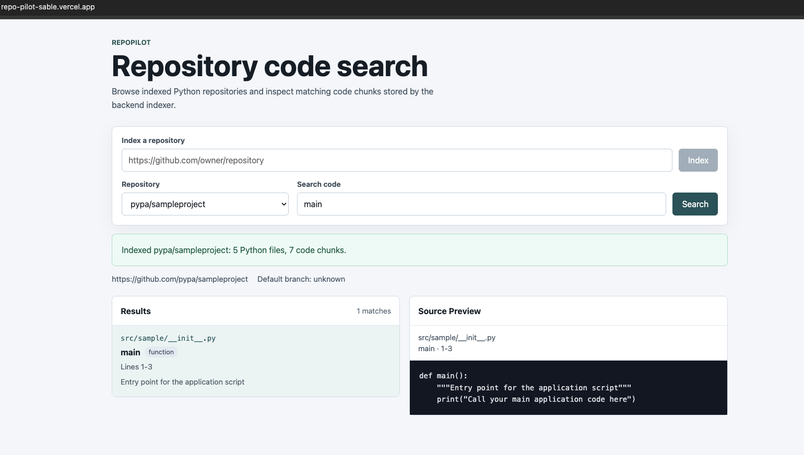

# RepoPilot

## Project overview

RepoPilot is a full-stack code search application for Python repositories. A user can index a public GitHub repository, select it from the web interface, and search the parsed code by symbol name, file path, docstring, or source text.

The backend parses Python files with the standard `ast` module, stores repositories, source files, and code chunks in PostgreSQL, and ranks search results with BM25-style scoring. Re-indexing the same repository refreshes the existing database record instead of creating duplicates.

## Why

`grep` and GitHub's own search match exact strings. If you don't already
know a function is named `validate_user_session`, searching "check if
someone's logged in" won't find it. RepoPilot indexes a repository's
structure ahead of time (symbols, docstrings, file paths, source) so
search can rank by relevance instead of requiring an exact string match.

A few specific choices worth explaining:

- **AST parsing over regex.** Regex-based symbol extraction breaks on
  multi-line signatures, decorators, and nested functions. `ast` handles
  all of that correctly because it's parsing the actual grammar, not
  approximating it.
- **BM25 over embeddings.** BM25 is precise, fast, and has no external
  API dependency or vector index to maintain, which fits a tool meant to
  index arbitrary public repos on demand. The tradeoff is BM25 matches
  terms, not meaning, so a query and its target need to share vocabulary.
  See `docs/search-evaluation.md` for where that tradeoff actually shows
  up in practice.
- **Postgres over re-parsing on every query.** Indexing is the expensive
  step (downloading, parsing, walking the whole repo). Persisting the
  result means search itself is cheap, and re-indexing an already-known
  repository is a refresh, not a rebuild.

## Live demo

- Frontend: https://repo-pilot-sable.vercel.app
- Backend API: https://aqueous-earth-43412-5f6428188142.herokuapp.com

### Example



*RepoPilot indexing a public GitHub repository and searching indexed Python code.*

## Features

- Index public GitHub repositories from the web interface
- Download public repository archives over HTTPS for production web indexing
- Parse Python functions, async functions, classes, and methods using AST
- Store repository metadata, source files, and code chunks in PostgreSQL
- Refresh existing repository records when re-indexing
- Search across symbol names, file paths, docstrings, and source code
- Rank results with BM25-style scoring and deterministic tie-breaking
- Show source previews and full source code for selected results
- Index local repositories or GitHub HTTPS URLs through the CLI
- Run the full application locally with Docker Compose
- Backend test suite with 100 passing tests

## How to use the live application

1. Open the Vercel frontend: https://repo-pilot-sable.vercel.app
2. Paste a public GitHub repository URL in this format:

   ```text
   https://github.com/owner/repository
   ```

3. Click **Index**.
4. Wait for the success message.
5. Select the indexed repository from the dropdown.
6. Search by function name, class name, file path, docstring, or source text.
7. Click a result to view its source code.

## How it works

RepoPilot has two indexing paths:

- The production web flow accepts a public GitHub repository URL, downloads the repository archive over HTTPS, extracts it temporarily, indexes Python files, and writes the results to PostgreSQL.
- The local CLI can index a local Git repository or clone a GitHub HTTPS URL using GitPython.

During indexing, RepoPilot walks Python files, skips common generated or dependency directories, and parses each file with the existing AST parser. The parser extracts top-level functions, async functions, classes, and methods, including symbol names, line ranges, docstrings, and source code.

The database stores repositories, source files, and code chunks as related records. When a repository is indexed again, the existing repository row is updated and its files and chunks are replaced with the latest indexed content.

Search is scoped to one indexed repository at a time. Queries are matched against symbol names, file paths, docstrings, and source code. Results are ranked with BM25-style scoring, with additional priority for exact and partial symbol matches.

## Tech stack

### Backend

- Python 3.12
- FastAPI
- SQLAlchemy
- PostgreSQL
- psycopg
- Typer
- GitPython
- pytest

### Frontend

- React
- TypeScript
- Vite
- CSS

### Development and deployment

- Docker
- Docker Compose
- Heroku
- Vercel

## Project structure

```text
backend/
  app/
    api/
    core/
    db/
    models/
    schemas/
    services/
    cli.py
    main.py
  tests/

frontend/
  src/

docker/
  postgres/

docker-compose.yml
```

## Running locally with Docker Compose

Start the application:

```bash
docker compose up --build
```

Open the frontend at:

```text
http://localhost:5173
```

The backend API is available at:

```text
http://localhost:8000
```

Interactive API documentation is available at:

```text
http://localhost:8000/docs
```

The default Docker Compose configuration starts PostgreSQL, the FastAPI backend, and the Vite frontend. Local database settings are defined in `.env.example`.

## Indexing through the CLI

Create the database tables if needed:

```bash
docker compose exec backend python -c "from app.db.base import Base; from app.db.session import engine; import app.models; Base.metadata.create_all(engine)"
```

Index the repository mounted at `/workspace`:

```bash
docker compose exec backend python -m app.cli index /workspace
```

You can also index another repository available inside the container:

```bash
docker compose exec backend python -m app.cli index /path/to/repo \
  --owner owner-name \
  --name repo-name \
  --url https://github.com/owner-name/repo-name
```

The CLI can infer repository metadata from GitHub HTTPS URLs and common GitHub `origin` remote formats. When metadata cannot be inferred, provide `--owner`, `--name`, and `--url`.

## API endpoints

The backend exposes these endpoints:

```text
GET /health
GET /repositories
POST /repositories/index
GET /repositories/{repository_id}
GET /repositories/{repository_id}/files
GET /repositories/{repository_id}/search?q=<query>
```

### `POST /repositories/index`

Indexes or re-indexes a public GitHub repository.

Request body:

```json
{
  "url": "https://github.com/owner/repository"
}
```

Successful response:

```json
{
  "repository": {
    "id": 1,
    "owner": "owner",
    "name": "repository",
    "url": "https://github.com/owner/repository",
    "default_branch": "main",
    "created_at": "2026-01-01T00:00:00Z",
    "updated_at": "2026-01-01T00:00:00Z"
  },
  "total_files": 12,
  "total_chunks": 48,
  "skipped_files": 0
}
```

Common error responses:

- `422` for an invalid GitHub repository URL
- `404` when the public repository archive cannot be found
- `413` when the repository archive exceeds the configured size limit
- `502` when the archive download or indexing process fails

## Running tests

Tests use a separate PostgreSQL test database.

Run the backend test suite with:

```bash
docker compose exec backend python -m pytest tests
```

Current backend test result:

```text
100 passed
```

## Search quality

The BM25 ranker is covered by unit tests, but ranking *quality* (does the
right result actually end up near the top) is measured separately: 18
hand-written queries against the real search function, evaluated on
RepoPilot's own indexed codebase.

```
Precision@1: 15/18 = 83.3%
Precision@3: 18/18 = 100.0%
MRR:         0.917
```

Full methodology, the two near-misses, and honest limitations of this
evaluation are in [`docs/search-evaluation.md`](docs/search-evaluation.md).
Run it yourself with `python backend/eval_search_quality.py`.

## Limitations

- Web indexing supports public GitHub repositories only.
- Private repositories are not supported.
- RepoPilot indexes Python files only.
- Web indexing runs synchronously, so large repositories can take longer to complete.
- Repository archives are subject to size limits.
- Public GitHub archive downloads are unauthenticated and may encounter GitHub rate limits.
- Repositories must be indexed before they can be searched.

